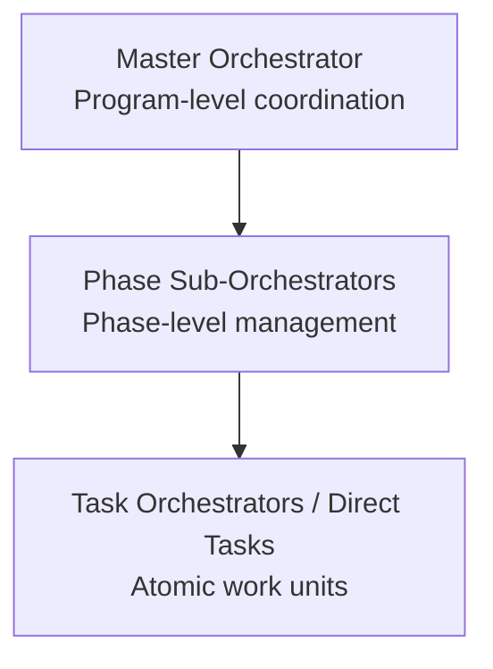

# Orchestrator Architecture

## 3-Layer Hierarchy

### Master Orchestrator

- Maintains awareness of the complete implementation plan
- Sequences phases and manages dependencies between them
- Makes go/no-go decisions at checkpoints
- Tracks overall progress via master state file

### Phase Sub-Orchestrator

- Manages a single phase (e.g., "Security Remediation", "Package Extraction")
- Decomposes phase objectives into discrete tasks
- Orders tasks respecting dependencies
- Reports progress to Master Orchestrator

### Task Orchestrator / Direct Delegation

- Executes atomic work: a security fix, a package extraction, a test suite
- For complex tasks (3+ steps with dependencies), use a Task Orchestrator
- For simple tasks (single file, well-defined), delegate directly

## Delegation Rules

### Spawn a Phase Sub-Orchestrator when:

- Starting a new implementation phase
- Phase has multiple independent workstreams
- Phase duration exceeds one session

### Spawn a Task Orchestrator when:

- Task has 3+ distinct sequential steps
- Steps have dependencies on each other
- Task spans multiple files or components

### Delegate directly when:

- Task is atomic and well-defined
- Can be completed in a single session
- No coordination with other tasks needed

## State Management

Each orchestrator maintains a state file tracking:

- Current status and progress percentage
- Active and completed tasks
- Blockers and decisions
- Next actions

State files live in a `progress/` directory and are the source of truth for resuming work across sessions.

## See Also

- [[README]] — Playbook overview
- [[quality-gates]] — Checkpoint definitions
- [[context-management]] — Managing context across sessions
